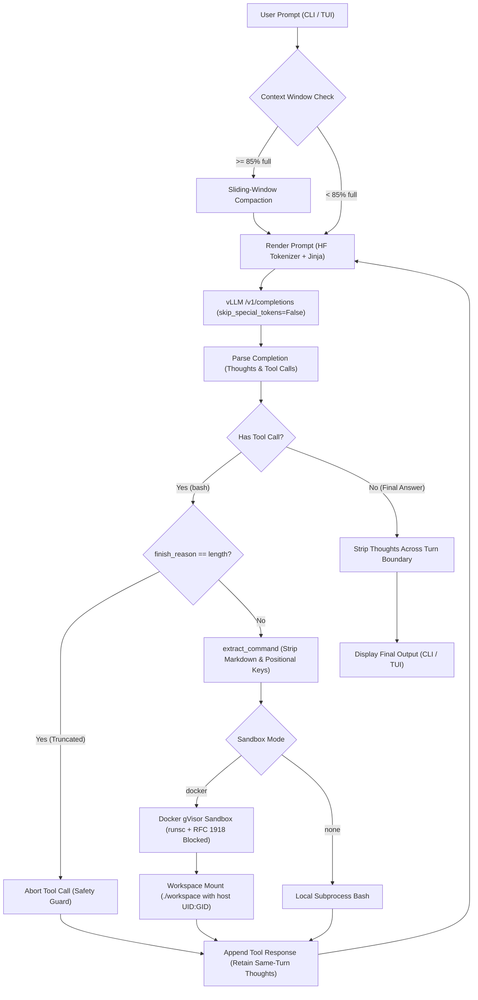

# Gemma 4 Reference Harness

A prototype-grade reference implementation and agent harness for **Gemma 4** (`wyattearp/Gemma-4-26B-A4B-it-NVFP4` and related Gemma 4 models).

---

## Quick Start

### Prerequisites
- Linux host with Python 3.10+
- Docker with [gVisor `runsc`](https://gvisor.dev/docs/user_guide/install/) installed
- Local vLLM instance serving Gemma 4 (e.g. `wyattearp/Gemma-4-26B-A4B-it-NVFP4`)

### Setup
```bash
# 1. Activate virtual environment
source .venv/bin/activate

# 2. Build sandbox image (if not already built)
docker build -t gemma4-sandbox:latest -f Dockerfile.sandbox .
```

---

### Running Tests
All tests adhere strictly to the **Red → Red → Green** methodology (failing happy-path test, failing sad-path test, clean implementation):

```bash
python -m unittest discover tests
```
## Features & Operating Modes

### 1. Interactive Mode (Textual TUI)
A complete terminal UI featuring:
- Live streaming thought log and tool execution panels.
- Real-time token counter tracking context capacity and tokens remaining before compaction.
- Slash command palette:
  - `/clear` - Reset context history and start a fresh session transcript.
  - `/compact` - Manually trigger sliding-window compaction.
  - `/thinking [on|off]` - Toggle model reasoning mode.
  - `/help` - Show available commands.
  - `/quit` - Exit the application.

```bash
python -m gemma_harness
```

### 2. One-Shot Mode (CLI)
Non-interactive headless execution for scripts and automated workflows:

```bash
python -m gemma_harness -p "Create a python script snake.py that runs a simple snake game, verify it runs without errors, then summarize."
```

#### Available CLI Options:
| Flag | Default | Description |
|---|---|---|
| `-p`, `--prompt` | `None` | One-shot prompt to run non-interactively |
| `--sandbox` | `docker` | Sandbox execution backend (`docker` or `none`) |
| `--sandbox-image` | `gemma4-sandbox:latest` | Docker image to use for the sandbox |
| `--workspace-dir` | `./workspace` | Host directory mounted into `/workspace` |
| `--max-turns` | `100` | Maximum agent turns before halting |
| `--max-response-tokens` | `4096` | Max tokens generated per model turn |
| `--thinking` / `--no-thinking` | `--thinking` | Enable or disable thought reasoning |
| `--temperature` | `0.2` | Sampling temperature |
| `--repetition-penalty` | `1.15` | Repetition penalty to mitigate loops |
| `-u`, `--base-url` | `$OPENAI_BASE_URL` | vLLM endpoint URL |
| `-k`, `--api-key` | `$OPENAI_API_KEY` | API key for the endpoint |
| `-m`, `--model` | auto-discover | Model ID (discovers via `/v1/models` if omitted) |
| `--transcripts-dir` | `.` | Directory to save JSONC session transcripts |

---

## Architecture & Workflow

The harness coordinates multi-turn reasoning, tool execution, context compaction, and sandbox containment in a procedural loop:



---

## Gemma 4 Specifications & Architectural Decisions

Building an agent harness for Gemma 4 requires addressing unique model behaviors, token formatting nuances, and tokenizer integration issues. Below are the key design decisions, the specific community issues and official documentation that prompted them, and how each is mitigated.

### 1. 256K Context Window & Sliding-Window Compaction
- **Reference**: [Gemma 4 Model Card](https://ai.google.dev/gemma/docs/core/model_card_4)
- **Problem**: Gemma 4 natively supports up to 256K context tokens (262,144 tokens), but individual turn completions are bounded by output token limits (typically 4096 tokens). In agentic loops, histories quickly accumulate thousands of tokens across multiple bash execution results.
- **Decision & Mitigation**: The harness configures `context_window = 256 * 1024` and `max_response_tokens = 4096`. To prevent runaway context exhaustion, it enforces sliding-window compaction at an 85% threshold (~222,822 tokens). Compaction procedurally discards older user/assistant turns while preserving the initial system prompt and recent turns down to 60% capacity. Both the CLI and TUI provide real-time status reporting tokens remaining before compaction.

### 2. Raw Completions vs. OpenAI Chat Endpoint
- **Reference**: [Gemma 4 Prompt Formatting](https://ai.google.dev/gemma/docs/core/prompt-formatting-gemma4)
- **Problem**: Gemma 4 relies on specialized structural tokens:
  - Turn delimiters: `<|turn>system`, `<|turn>user`, `<|turn>model`, and turn closing `<turn|>`.
  - Thinking channel: `<|think|>` token in system turn triggers `<|channel>thought\n...\n<channel|>`.
  - Tool calls: `<|tool_call>call:name{arg:<|"|>val<|"|>}<tool_call|>`.
  - Tool responses: `<|tool_response>response:name{...}<tool_response|>`.
  Standard vLLM `/v1/chat/completions` strips `<|channel>thought` reasoning channels during tool calling. Furthermore, standard `/v1/completions` defaults to `skip_special_tokens=True`, which silently strips `<|tool_call>` (token ID 48) and `<tool_call|>` (token ID 49), corrupting output parsing regexes.
- **Decision & Mitigation**: The harness renders prompts client-side using Hugging Face `AutoTokenizer` chat templates and dispatches them directly to `/v1/completions` with `skip_special_tokens=False` and explicit stop tokens `["<turn|>", "<|tool_response>"]`. Both thoughts and structured function calls are preserved.

### 3. Thinking Mode & Thought Retention Semantics
- **Reference**: [Google AI Thinking Capabilities](https://ai.google.dev/gemma/docs/capabilities/thinking)
- **Problem**: Google's official documentation defines strict guidelines regarding model thinking in agent workflows:
  1. *Standard Multi-Turn Conversations*: Models were not trained to consume their own previous thoughts across turns. Thoughts from prior turns must be stripped from conversation history before passing history back for subsequent turns.
  2. *Function Calling (Exception)*: If a model turn involves intermediate tool calls, the model's thoughts *must not* be stripped between calls within that same turn.
- **Decision & Mitigation**: The harness retains `thinking` / `reasoning` in the assistant turn while looping through intermediate tool calls and tool responses, but strips thoughts when serializing completed assistant responses into multi-turn history.

### 4. Tool Call Delimiters and Stop Tokens
- **Reference**: [Hugging Face Transformers PR #45257](https://github.com/huggingface/transformers/pull/45257)
- **Problem**: In older releases of Hugging Face `transformers`, the Gemma-4 chat template lacked proper support for closing delimiters (`<tool_call|>` vs `<|tool_call|>`) and did not include `<tool_call|>` as a stop token in standard response parsing. This caused completions to stream past the tool call delimiter into subsequent model turns or get stuck in generation loops.
- **Decision & Mitigation**: The client patches and normalizes the tokenizer's response formatters, adds `<tool_call|>` and `<tool_response|>` to stop token sequences, and ensures closing delimiters are handled cleanly during parsing.

### 5. Positional Keys, Markdown Fences & Repetition Loops
- **Reference**: [Gemma 4 Discussion #77: Tool calling issues](https://huggingface.co/google/gemma-4-31B-it/discussions/77) & [Function Calling Guide](https://ai.google.dev/gemma/docs/capabilities/text/function-calling-gemma4)
- **Problem**: In practice, Gemma 4 frequently generates tool arguments using positional dictionary keys (such as `{"1": "..."}` or `{"0": "..."}`) rather than `{"command": "..."}`. Additionally, the model often wraps shell commands in conversational prose or markdown code blocks (e.g. ````bash\ncat << 'EOF' > file\n...\nEOF\n````). If tool calling syntax fails, the model can enter cyclical repetition loops.
- **Decision & Mitigation**:
  - `Agent.extract_command()` inspects `"command"`, `"1"`, `"0"`, and sole dictionary keys, and extracts commands out of markdown code blocks using regular expressions.
  - Repetition penalty defaults to `1.15` in `AgentConfig` to prevent cyclical loops.
  - **Truncation Guard**: If generation halts because `finish_reason == "length"` before completing the tool call closing delimiter, execution is aborted with an explanatory error. This prevents executing dangerous, cut-off shell commands (e.g. incomplete file writes or unclosed shell quotes).

### 6. Secure, Proxy-Free gVisor Sandbox
- **Problem**: Executing arbitrary bash commands generated by LLMs on the host filesystem is dangerous. While prior harness implementations relied on complex multi-container Docker networks and TLS proxy MITM containers, that design is heavy and brittle.
- **Decision & Mitigation**:
  - **gVisor Isolation**: The sandbox container runs under `--runtime runsc`, providing strong kernel-level isolation against container escapes.
  - **Option B Network Isolation**: The container is started with outbound internet enabled (for `pip`, `curl`, `git`), but immediately injects unreachable kernel routes for all RFC 1918 private subnets (`10.0.0.0/8`, `172.16.0.0/12`, `192.168.0.0/16`). This completely blocks the model from probing or accessing the host or local network without requiring proxy containers.
  - **Workspace Persistence**: The host directory `./workspace` is mounted directly into `/workspace` inside the container.
  - **Host User File Ownership**: Commands are executed using `--user $(id -u):$(id -g)` so that all files created by the agent are owned by the host user (`wyatt:wyatt`), avoiding root-locked files on the host.
  - **Rich Development Environment**: Built from [`Dockerfile.sandbox`](file:///home/wyatt/git_repos/gemma4-reference-harness/Dockerfile.sandbox) containing `gcc`, `g++`, `make`, `git`, `curl`, `wget`, `jq`, `ripgrep`, `tree`, `file`, archive utilities (`tar`, `gzip`, `bzip2`, `xz-utils`, `unzip`, `zip`), `pytest`, `requests`, and `numpy`.

---

## Session Transcripts
Every interaction is logged to `./transcripts/{isodate}.jsonc` containing full structured event logs:
- Raw prompt texts and completion tokens.
- Parsed thought channels and structured function calls.
- Tool commands, exit codes, stdout, and stderr.
- Sliding-window context compaction events.
